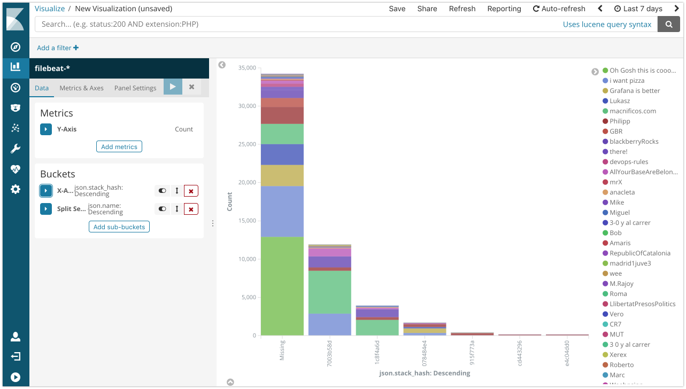
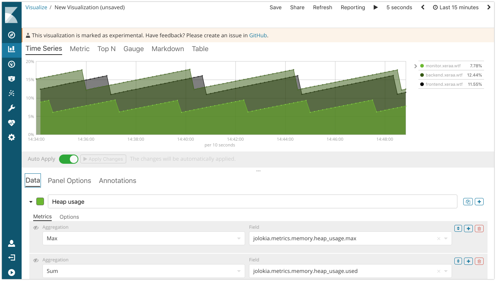
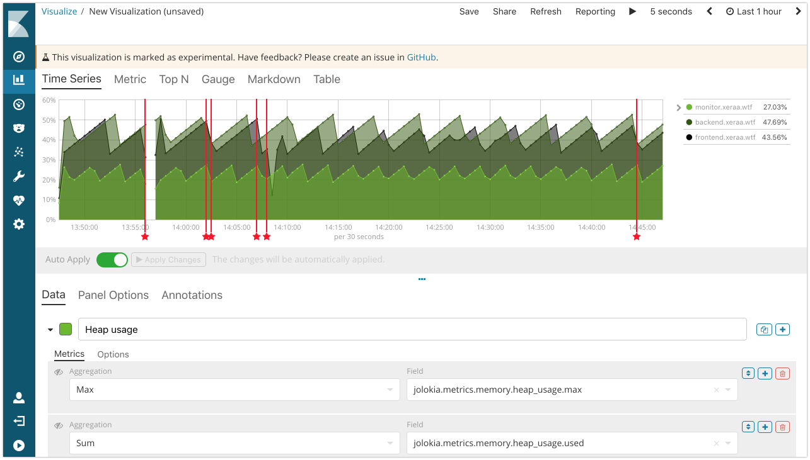

# Microservice Monitoring

Monitor logs, metrics, pings, and traces of your distributed (micro-) services. There are also [slides](https://speakerdeck.com/xeraa/360-degrees-monitoring-of-your-microservices) walking you through the features of this repository.

## Features

* **X-Pack Monitoring**: Start the overview page to show the systems we are using for monitoring.
* **Metricbeat System**: Show the *[Metricbeat System] Overview* dashboard in Kibana and then switch to *[Metricbeat System] Host overview*.
* **Infrastructure UI**: As an alternative view show the Infrastructure UI and explain how this will scale much better.
* **Packetbeat**: Show the *[Packetbeat] Overview*, *[Packetbeat] Flows*, *[Packetbeat] MySQL performance*, and *[Packetbeat] HTTP* dashboard, let attendees access the various URLs and see the corresponding graphs. In *Discover* you can point out the `proc` enrichment for nginx, Java, and MySQL. Optionally show the *[Packetbeat] TLS Sessions* and *[Packetbeat] DNS Tunneling* dashboards as well.
* **Filebeat modules**: Show the *[Filebeat Nginx] Access and error logs*, *[Filebeat MySQL] Overview* (might need a wider time window to see anything useful), *[Filebeat System] Syslog dashboard*, *[Filebeat System] SSH login attempts*.
* **Filebeat**: Let attendees hit */good* with a parameter and point out the MDC logging under `json.name` and the context view for one log message. Let attendees hit */bad* and */null* to show the stacktrace both in the JSON log file and in Kibana by filtering down on `application:java` and `json.severity: ERROR`. Also point out the cloud `meta.*` and `host.*` information. And show the `json.stack_hash`, which you can use for visualizations too.

* **Auditbeat**: Show changes to the */opt/* folder with the *[Auditbeat File Integrity] Overview* dashboard.
* **Heartbeat**: Run Heartbeat and show the *Heartbeat HTTP monitoring* dashboard in Kibana, then stop and start the frontend application with `ansible-playbook restart_frontend.yml` or do it manually and see the change.
* **Metricbeat**: Show the *[Metricbeat Nginx] Overview* and *[Metricbeat MySQL] Overview* dashboards.
* **Metricbeat HTTP**: Show */health* and */metrics* with cURL (credentials are `admin` and `secret`). Then collect the same information with Metricbeat's HTTP module and show it in Kibana's Discover tab.
* **Metricbeat JMX**: Display the same */health* and */metrics* data and its collection through JMX.
* **Visual Builder**: Build a more advanced visualization with the Time Series Visual Builder, for example to show the heap usage in percent by calculating the average of `jolokia.metrics.memory.heap_usage.used` divided by the max of `jolokia.metrics.memory.heap_usage.max`.

* **Annotations**: Include the deployment *events* as an annotations.

* **APM**: Show the traces so far, point out the MySQL queries (currently on the backend instance only), and where things are slow or throwing errors. If there is not enough activity on the instances, call `./ab.sh` on the monitor instance. Also show errors and metrics.
* **Kibana Dashboard Mode**: Point attendees to the Kibana instance to let them play around on their own.

## Setup

If the network connection is decent, show it on [Amazon Lightsail](https://amazonlightsail.com). Otherwise fall back to the local setup and have all the dependencies downloaded in advance.

### Lightsail

Make sure you have run this before the demo, because some steps take time and require a decent internet connection.

1. Make sure you have your AWS account set up, access key created, and added as environment variables in `AWS_ACCESS_KEY_ID` and `AWS_SECRET_ACCESS_KEY`. Protip: Use [https://github.com/sorah/envchain](https://github.com/sorah/envchain) to keep your environment variables safe.
1. Create the Elastic Cloud instance with the same version as specified in *variables.yml*'s `elastic_version`, enable Kibana, enable APM, and set the environment variables with the values for `ELASTICSEARCH_HOST`, `ELASTICSEARCH_USER`, `ELASTICSEARCH_PASSWORD`, `KIBANA_HOST`, `KIBANA_ID`, `APM_HOST`, and `APM_TOKEN`.
1. Change into the *lightsail/* directory.
1. Change the settings to a domain you have registered under Route53 in *inventory*, *variables.tf*, and *variables.yml*. Set the Hosted Zone for that domain and export the Zone ID under the environment variable `TF_VAR_zone_id`. If you haven't created the Hosted Zone yet, you should set it up in the AWS Console first and then set the environment variable.
1. If you haven't installed the AWS plugin for Terraform, get it with `terraform init` first. Then create the keypair, DNS settings, and instances with `terraform apply`.
1. Open HTTPS on the network configuration on both instances (waiting for this [Terraform issue](https://github.com/terraform-providers/terraform-provider-aws/issues/700) to automate these steps).
1. Apply the base configuration to all instances with `ansible-playbook configure_all.yml`.
1. Apply the instance specific configuration with `ansible-playbook configure_backend.yml`.
1. Deploy the JARs with `ansible-playbook deploy_backend.yml` and `ansible-playbook deploy_frontend.yml` (Ansible is also building them).

When you are done, remove the instances, DNS settings, and key with `terraform destroy`.

### Workshop

Very similar to the Lightsail setup above. The main difference is that everything is running on one instance and you need to open the port 5601 for Kibana (Elasticsearch, APM,... are only accessible on localhost) and 88 if you want to include the PHP examples.

Credentials:

* SSH: `ssh elastic-admin@workshop-<number>.xeraa.wtf` elastic-admin / secret
* Elasticsearch: `http://localhost:9200` admin / secret
* Kibana: `http://workshop-<number>.xeraa.wtf:5601` admin / secret

### Local

Make sure you have run this before the demo, because some steps take time and require a decent internet connection.

1. Change into the *local/* directory.
1. Run `docker-compose up`, which will bring up Elasticsearch, Kibana, and all the Beats.
1.
1.
1. Run the Java applications from their directories with `./gradle bootRun`.
1.

When you are done, stop the Java applications and remove the Docker setup with `docker-compose down -v`.

## Todo

* Test and document the Docker-Compose flow
* Redo the story since the content changed a bit over time
* https://tech.paulcz.net/blog/spring-into-kubernetes-part-1/
* https://codecentric.github.io/chaos-monkey-spring-boot/
* Micrometer / http://docs.spring.io/spring-boot/docs/current/reference/html/production-ready-metrics.html
* Kubernetes
* Functionbeat (though there are no CloudWatch metrics for Lightsail)
* https://github.com/elastic/examples/blob/master/Alerting/Sample%20Watches/errors_in_logs/watch.json
* Better Watch syntax as in https://github.com/elastic/examples/blob/master/Alerting/Sample%20Watches/unexpected_account_activity/watch.json
